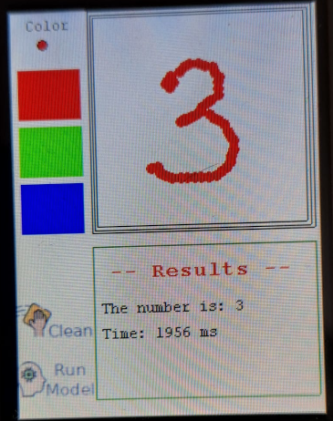

# Handwritten number recognition: a TinyML application using TFLM

[Tensorflow Lite for Micrcontroller](https://www.tensorflow.org/lite/microcontrollers) (TFLM) is a framework that is a subset of Tensorflow which is designed to execute machine learning model on resources constrained devices i.e. microcontrollers.

The following repository will provide anyone having a [STM32F429I-DISC1](https://www.st.com/en/evaluation-tools/32f429idiscovery.html) the ability of executing this TinyML application which is: 

A model train with The [MNIST](http://yann.lecun.com/exdb/mnist/) database which could make the inference on the number drawn on the LCD. From 0 to 9.

[model_running.webm](https://github.com/reymor/stm32f429-tflite-micro-mnist/assets/39070043/ee4e4d3d-7cc5-4812-ba92-d57546da7d25)

## Model

The model was trained in this [Colab](https://colab.research.google.com/drive/1VplKYj2p9_9LHHPtLSMRfFzcTP--8NoM?usp=sharing)

## Author

reymor
