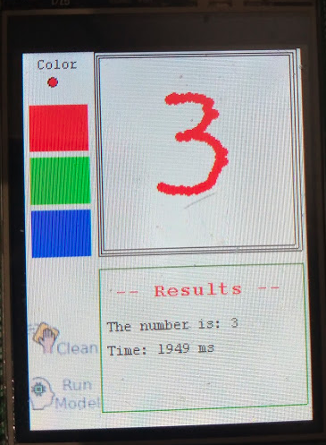

# stm32f429-tflite-micro-mnist

I was playing around with Tensoflow Lite for microcontrollers. 

This model could predict the number that was drawn on the lcd. From 0 to 9. 

## Model

The model was trained in this [Colab](https://colab.research.google.com/drive/1VplKYj2p9_9LHHPtLSMRfFzcTP--8NoM?usp=sharing)

## Author

reymor